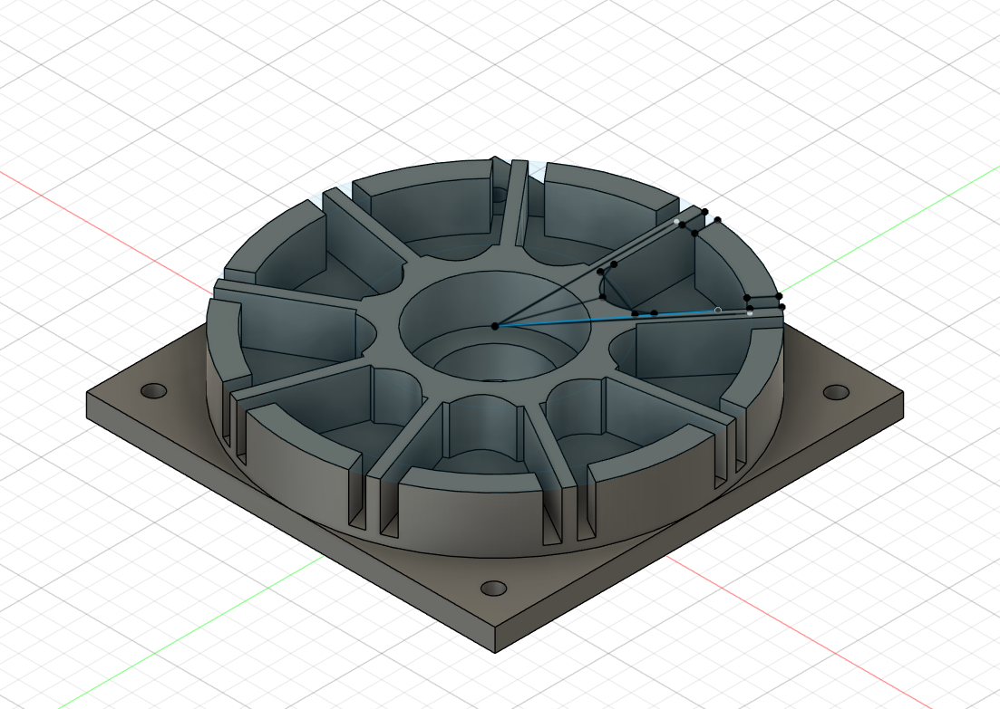
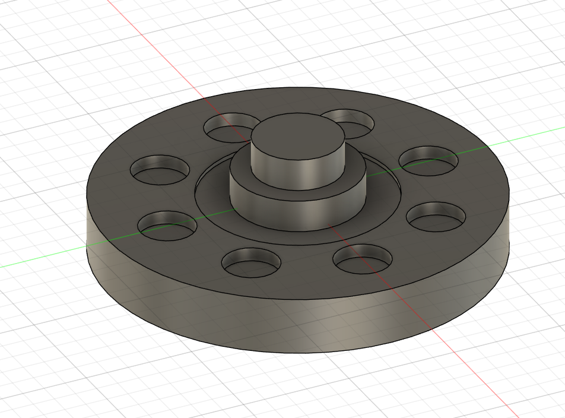
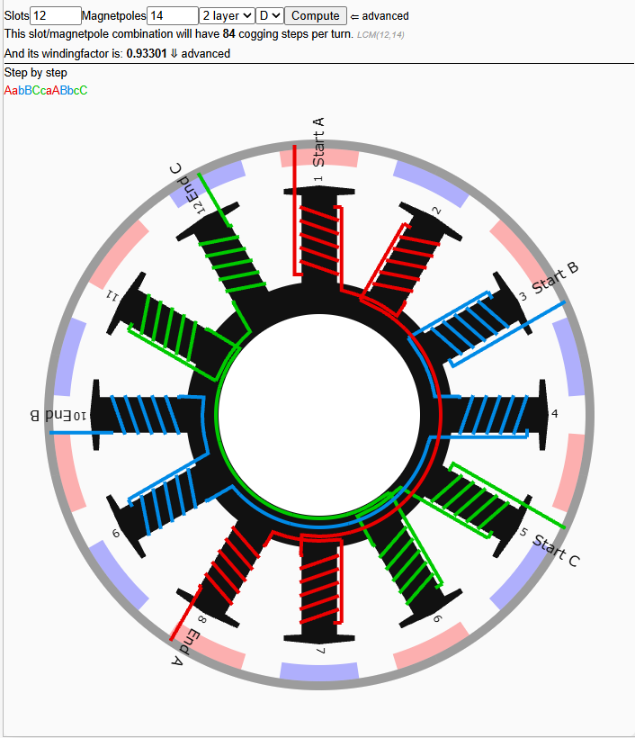
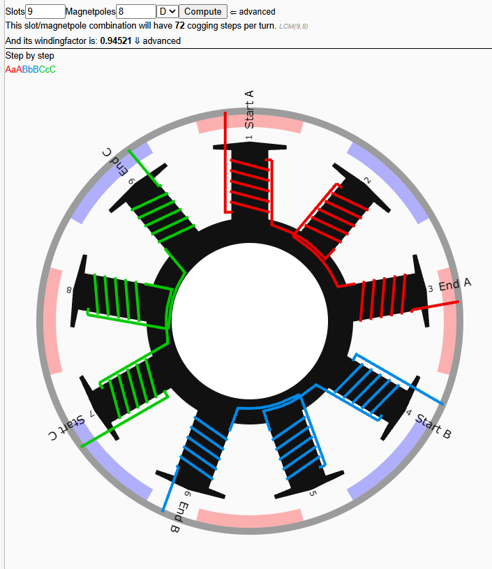

# Axial-Flux-Motor-Design-and-Build

Description
This project is a full-cycle design and build of a coreless axial flux permanent-magnet synchronous motor, from first-principles electromagnetic design through CNC-machined hardware and closed-loop FOC control. The design process covers magnetic circuit analysis (air-gap sizing via the permeance/load-line method, NdFeB magnet grade selection under real thermal and demagnetization constraints), torque and current sizing from a shear-stress/torque-density model, slot/pole optimization for cogging and winding-factor trade-offs, and structural analysis of axial magnetic attraction forces on the rotor assembly. The motor is hand-wound (9 slots, 8 poles), driven by a VESC running field-oriented control, with a custom-built dynamometer and DAQ instrumentation to validate the as-built performance against the design targets.

## Origin

This project began with a tour of the Integrated Power Services (IPS) warehouse, where a presentation on electric motor theory and design was followed by a walkthrough of the full facility, watching motors being designed, built, and rebuilt across every stage of their lifecycle. That tour sparked an interest that deepened considerably while working at TECO, where I spent a summer working exclusively with the electric motors across the company's power plants. I was struck by just how many varieties, builds, specifications, and features a single category of machine could have: a genuinely vast design space, where every choice carried real trade-offs. Electric motors became the one subject in my degree that held my attention more than anything else, and that summer, I was hooked.

What draws me to them is that a well-designed electric motor sits at the intersection of mechanical, electrical, and materials engineering. It demands tight tolerances, high operating temperatures and speeds, and it offers a kind of universal utility, since the same machine that drives a load as a motor can just as easily run in reverse as a generator. Motors quietly drive the modern world from inside power plants and industrial facilities everywhere, and I wanted to be someone who designs them, not just maintains them.

That's what led to the idea of building my own. Nothing would teach me more about electric motors than being forced to reckon with every single aspect of one, start to finish. I chose an axial flux topology specifically for its novelty and its growing relevance in drones and electric vehicles, and, practically speaking, because many of the electrical engineers I worked with at TECO didn't know what an axial flux motor even was. That told me I'd be teaching myself something genuinely underexplored in the field, not just repeating a well-worn design.

## First Design Choices

I was able to enroll in an independent study course and count this project and experience toward one of my elective classes. The catch was a 16-week timeline to teach myself enough about electric motors to design one, build it, test it, and iterate on the design to fix problems and make improvements. My initial plan was to spend the first month reading textbooks, then take a week or two to design the motor, another week or two to manufacture it, and use the remaining weeks for testing, iteration, and data collection.

After three weeks of reading, I had gone so far down the technical rabbit hole that I realized just how many small mistakes could render the entire motor inoperable. I needed to prototype rapidly and confirm each step actually worked before committing to a full design and machining stock aluminum, which is expensive and unforgiving of errors.

My new plan became to put together a barely feasible design in a single day and 3D print it, just to confirm the geometry made sense at all. Once I had something physical in my hands, I knew I would be able to see the next steps more clearly and catch future problems much faster.

I used Fusion, by Autodesk, for the design, since Fusion made the whole workflow practical in a single piece of software. It exports cleanly for 3D printing, so moving a design from CAD to a printable file was straightforward, and it includes a Manufacture workspace that generates toolpaths directly compatible with the Tormach 770M. That meant I could design, prototype, and eventually machine the final part without ever switching tools or translating files between platforms, which cut out a whole category of errors that come from moving a design between incompatible software.

**Stator and Rotor Design**

The stator design incorporated a recess to seat the axial thrust bearing, which is necessary to let the motor rotate freely even while a substantial force is pushing down on the bearing. Traditional radial bearings are not designed to handle axial loads and would pinch their ball bearings and seize under this kind of force. The axial thrust bearing chosen for this design is rated for a dynamic load of up to 3,500 pounds, far more than enough margin for this application. The stator frame's square base, with mounting holes at each corner, exists specifically so the motor can be bolted directly to a table for testing purposes.

The rotor design incorporated the shaft as a built-in stepped feature. The smaller, center portion is 40mm in diameter and fits inside the axial thrust bearing, while the larger step is 60mm and sits directly on top of the bearing to distribute the load across it. Recessed pockets in the rotor hold the 1-inch diameter magnets in place, secured with epoxy or adhesive.

*Design 1.0 of the Stator*

*Design 1.0 of the Rotor*

**Constraints and Priorities**

This design followed a deliberate process, worked through in order:

What are the absolute constraints?
What are the soft constraints?
What are the priorities on performance and cost?
What is the hierarchy of those priorities, and how does that hierarchy drive the design choices?

The first absolute constraint was the machine that would actually cut the final stator and rotor: a Tormach 770M. Pulling its spec sheet, I found a Y-axis travel distance of 7.5 inches, the smallest of its three axes, which directly capped the largest motor diameter I could build while keeping the housing in machined aluminum. I settled on a 7-inch diameter, leaving a half inch of clearance. The Tormach is also a 3-axis machine, which meant any design requiring more axes to manufacture was off the table from the start.

The soft constraints were time and cost. I needed a design that minimized material cost and minimized manufacturing time, driven by a hard 16-week deadline. Once I started sourcing parts and pricing materials, the first thing that stood out was just how expensive neodymium magnets actually were. My original design called for 12 slots and 14 poles, which meant more copper wire and more magnets than I'd budgeted for. 

*12 Slot and 14 Pole Winding Arrangement*

After working through slot and pole configuration tables to compare winding factor and cogging steps across different combinations, I landed on a 9-slot, 8-pole arrangement that actually had a better winding factor and nearly identical cogging performance to my original design. That single change cut material cost nearly in half and roughly halved assembly time as well.

*9 Slot and 8 Pole Winding Arrangement*

With those constraints in place, I ranked my priorities as follows: cost, difficulty of manufacturing, accessibility of resources to learn the chosen winding approach, lead time and availability of materials, testability, torque, speed, and longevity, in that order.

One early discovery reshaped my magnet selection significantly. Neodymium magnets are not inherently heat-tolerant. Maintaining their magnetization at elevated temperatures requires selecting an H-grade or SH-grade variant rather than the standard grade. Standard N42 magnets demagnetize significantly around 80 degrees Celsius, a temperature I could realistically reach within minutes of starting the motor, which made the standard grade essentially unusable for this application. The only H-grade or higher magnets I could find were 1-inch diameter discs, around $10 each, in N42SH, a genuinely strong grade for this application. But their small disc size left a lot of dead space between poles that contributed nothing to torque.
